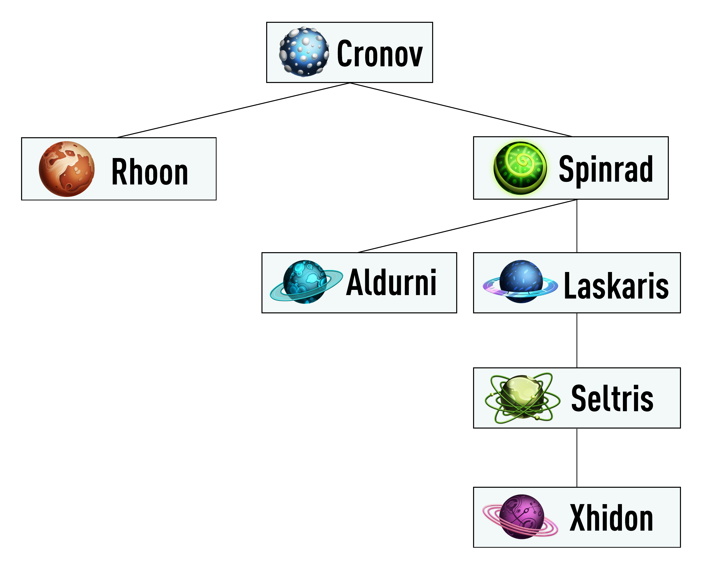

# Welcome

 

Welcome to The k8s Boilerplate project (k8sb).

## Goal
The main goal of this project is to show you an operating procedure to deploy an app on Kubernetes using code templates.

## What this guide covers
1. Project structure.
2. The k8sb's images contexts.   
3. The Social microservice.
4. Why k8sb is important?

### 1. Project structure.
* This project has four main parts: 
  * A Bash library called [Zemni](https://github.com/v8tix/zemni), 
  * A set of Docker containers built using Zemni:
    * [Cronov](https://github.com/v8tix/cronov)
    * [Rhoon](https://github.com/v8tix/rhoon)
    * [Spinrad](https://github.com/v8tix/spinrad)
    * [Laskaris](https://github.com/v8tix/laskaris)
    * [Seltris](https://github.com/v8tix/seltris)
    * [Aldurni](https://github.com/v8tix/aldurni)
    * [Xhidon](https://github.com/v8tix/xhidon)
      * Each container forms an inheritance relationship as it's shown in the following figure:
      
  * The [Social](https://github.com/v8tix/social) microservice, and    
  * The [social2k8s](https://github.com/v8tix/social2k8s) project.    
### 2. The k8sb's images contexts.
* Each image was build taken into account four main contexts:
  * Configuration and packages:
    * Used to initialize the necessary repositories, and the system packages.
  * External libraries.
    * Add some utilities that can help you to configure your containers (e.g. [Zemni](https://github.com/v8tix/zemni)). 
  * Security.
    * Here you can prevent attacks like [DNS, ARP and IP spoofing](https://www.tigera.io/blog/prevent-dns-and-other-spoofing-with-calico/).
  * Clean up.
    * Delete documentation, cache, and logs generated in the Configuration and packages context.
* In the following figure, you can appreciate an example of these contexts:

### 3. The Social microservice.
* In order to run the Seltris, and the Xhidon image, you need a Spring Boot application. The Social microservice is a good fit because its configuration was externalize.
* You can find more information about how to set up this microservice by following this [link](https://github.com/v8tix/social).  
### 4. Why k8sb is important?
* Help you to keep your artifacts well organized. 
* Eliminate chains of Bash commands from Docker files instructions. Instead, an instruction becomes an interface to the Bash functions.
* Promotes both, functions and contexts reusability. You don't need to write it again.
* Let you patch quickly security vulnerabilities.
* Testing becomes easy using functions instead of inline commands chains.
## Authors
* Initial work

 
&nbsp;&nbsp;&nbsp;&nbsp;&nbsp;&nbsp;&nbsp;[Contact us](mailto:info@v8tix.com)

## License  
<a rel="license" href="http://creativecommons.org/licenses/by/4.0/">&nbsp;</a>This work is licensed under a [Creative Commons Attribution 4.0 International License](http://creativecommons.org/licenses/by/4.0/).
